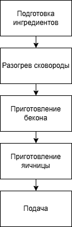

# Инструкция по приготовлению яичницы с беконом

## Введение
Яичница с беконом — простой и сытный завтрак, который можно приготовить за несколько минут. Сейчас я расскажу, как это сделать.

## Ингредиенты
Чтобы приготовить яичницу с беконом, нужно:
- Яйца — 2 шт.
- Бекон — 2–3 ломтика
- Соль — по вкусу
- Перец — по вкусу
- Растительное масло (или сливочное) — 1 ст. ложка

## Оборудование
- Сковорода
- Лопатка
- Тарелка для подачи

## Схема

## Пошаговая инструкция

1. Достаньте яйца, бекон и специи. Если бекон заморожен, дайте ему немного оттаять.
2. Разогрейте сковороду на среднем огне, добавьте масло. Дождитесь, когда сковорода нагреется.
3. Обжарьте бекон с обеих сторон до золотистой корочки (2–3 минуты с каждой стороны).
4. Переложите бекон на тарелку с бумажным полотенцем, чтобы убрать излишки жира.
5. На той же сковороде пожарьте яйца и добавьте специи.
6. Положите готовую яичницу на тарелку, добавьте бекон.
